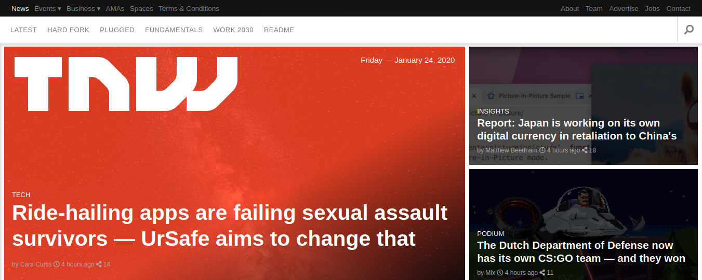

# The Next Web

> To create a fully responsive replica of [The Next Web](https://thenextweb.com/) website, which gracefully degrades as the screen size is reduced.

## Implementation Details

[See wiki pages](https://github.com/cliftondavies/The-Next-Web/wiki)

## Technologies Used

- HTML, CSS.
- Github, Git, Visual Studio Code.
- Pesticide, Font Awesome, Picular.

## Live Demo

[Live Demo Link](https://cliftondavies.github.io/The-Next-Web/)

## Authors

👤 **Clifton Davies**

- Github: [@githubhandle](https://github.com/cliftondavies)
- Twitter: [@twitterhandle](https://twitter.com/cliftonaedavies)
- Linkedin: [linkedin](https://www.linkedin.com/in/clifton-davies-mbcs/)

## 🤝 Contributing

Contributions, issues and feature requests are welcome!

Feel free to check the [issues page](https://github.com/cliftondavies/The-Next-Web/issues).

## Show your support

Give a ⭐️ if you like this project!

## Acknowledgments

- The Corgis!

## 📝 License

This project is [MIT](https://opensource.org/licenses/MIT) licensed.
